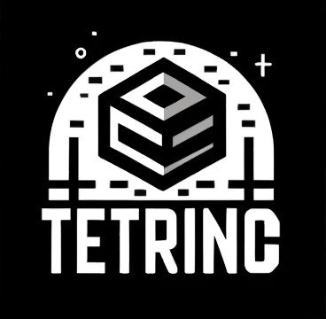
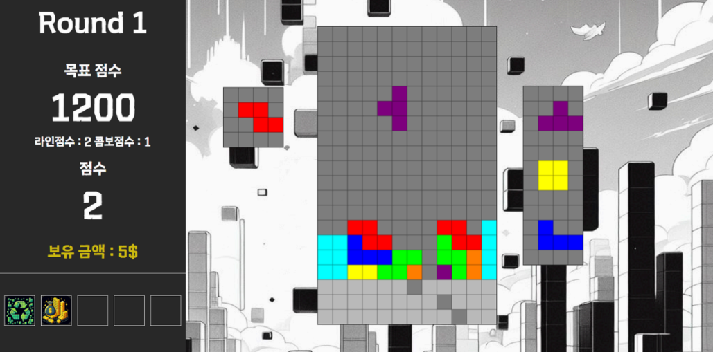
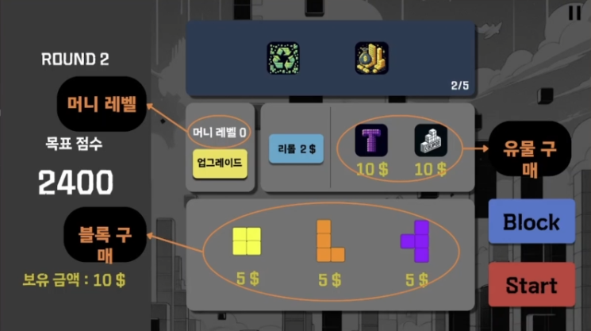

# TETRING — 테트리스 × 덱빌딩 웹 게임

> **한 줄 소개**
> 
> 클래식 퍼즐 **테트리스**에 **덱빌딩 전략**을 결합해, 손맛과 전략을 동시에 느낄 수 있도록 설계한 웹 게임입니다.  
> 라운드별 목표 점수를 달성하며, 상점에서 유물/블록을 조합해 시너지를 만드는 것이 핵심입니다.

  

---

## 스크린샷

   
  <em>플레이 화면 — 콤보·라운드 목표 UI</em>

   
  <em>상점 — 희귀도/중복 방지/리롤 인터랙션</em>

---

## 레파지토리

- **Backend (Spring Boot)**  
  <[테트링 백엔드](https://github.com/Bracket-team/tetring-backend)>  
  간단 설명: OAuth2 + Spring Security, Redis 기반 Refresh Token, JPA/MySQL.

- **Frontend (React)**  
  <[테트링 프론트엔드](https://github.com/Bracket-team/tetring-react)>  
  간단 설명: React

---

## 왜 만들었나
- 순발력 중심의 기존 테트리스에 **중·장기 의사결정의 재미**를 더해보고자 했습니다.  
- “속도만 빨라지는 난이도” 대신, **라운드 목표 점수**와 **경제·상점 시스템**을 통해 다른 형태의 압박과 선택지를 제공하려 했습니다.  
- 반복 플레이에서도 새로운 전략이 나오도록 **유물(효과) 중복 방지**, **희귀도 기반 확률**, **리롤(reroll)** 등을 설계했습니다.

---

## 핵심 컨셉
- **즉시성 × 전략성**: 조작은 그대로 가볍게, 점수 메타는 깊게.  
- **선택의 의미**: 상점 구매/리롤/머니 레벨업 타이밍이 라운드 성과를 좌우.  
- **가시성**: 점수·콤보·라운드 목표를 명확히 보여 주어, 플레이어가 스스로 전략을 수립하게.

---

## 주요 기능
- **라운드 목표 점수**: 각 라운드마다 달성해야 하는 목표가 있으며, 라운드가 올라갈수록 목표가 상승합니다.  
- **스코어링**: 연속 라인 제거로 **콤보**를 쌓거나 다중 라인 제거로 **라인** 점수를 크게 올릴 수 있습니다.  
- **유물(레릭) 시스템**: 희귀도에 따라 등장하며, **중복 방지**로 다양성과 조합의 재미를 유지합니다.  
- **상점 & 리롤**: 재화를 사용해 유물/블록을 구매하거나, **리롤**로 목록을 갱신합니다.  
- **머니 레벨 시스템**: 라운드/상황에 맞춰 **수입을 늘리는 레벨업**을 선택할 수 있습니다.  
- **리더보드 & 도감**: 최고 점수를 기록하고, 발견한 유물을 **도감**으로 확인합니다.

---

## 시스템 한눈에 보기
- **클라이언트**: 브라우저 기반 플레이, 조작/시각화/인게임 UI, 테트리스 로직 구현
- **백엔드**: 점수 저장, 상점/유물 로직, 리더보드  
- **데이터**: 유물 정의, 희귀도/가격/효과, 플레이 기록
 
> React로 프론트 엔드 기능 구현  
> Spring Boot를 사용해 백엔드 기능 구현  
> AWS EC2 + RDS를 통한 배포  
> Docker를 통한 배포 관리  

---

## 개발 포인트 & 이슈 해결
- **밸런싱**:  
  - 초중반 과금 압박 완화, 후반 스노우볼 억제를 위해 **리롤 가격 곡선**과 **머니 레벨 수치**를 알파 테스트를 통해 여러 차례 조정했습니다.  
  - 라운드 목표 점수 테이블을 재설계하여 “손맛”과 “전략”의 균형을 맞췄습니다.
- **성능/안정성**:  
  - 상점·유물 로직의 **중복 방지/확률 제어**를 일관성 있게 유지하도록 서버 검증 로직을 강화했습니다.  
  - 로그인 기능을 구현하기 위해 Sprint Security + OAuth2.0 사용하여 구현
- **품질 관리**:  
  - 테스트 플레이(알파)와 로그 관찰을 통해 **체감 난이도**와 **선호 빌드**를 파악하고 지표 기반으로 개선했습니다.

---

## 기술 스택 
- **Frontend**: React
- **Backend**: Spring Boot, Spring Security, JPA
- **Infra/DB**: MySQL, Redis, Docker
- **Collab**: Notion, Git

---

## 팀 & 역할
- **<송하준>** — 백엔드/설계 총괄, 게임 로직 개발
- **<박성우>** — 프론트엔드, 게임 로직 개발  
- **<박재혁>** — UI/UX  

---

## 앞으로의 계획
- 신규 유물/시너지 추가 및 고난도 라운드 확장  
- 플레이 데이터 기반 자동 밸런싱 실험  
- 접근성/튜토리얼 개선

---
